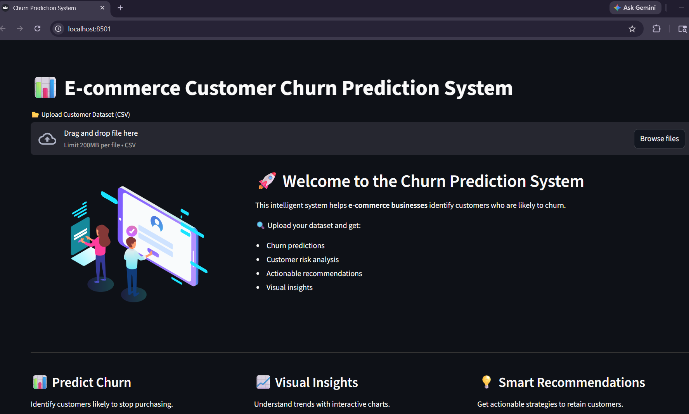
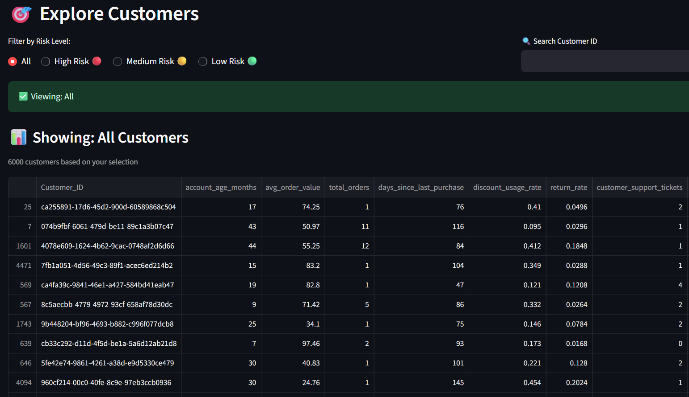
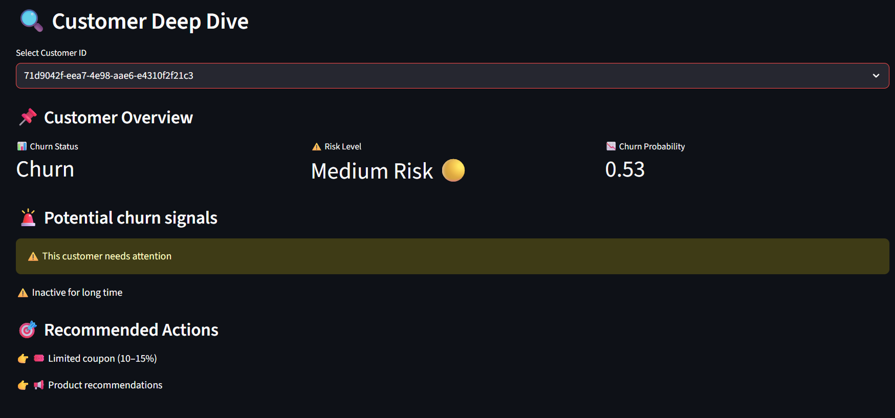
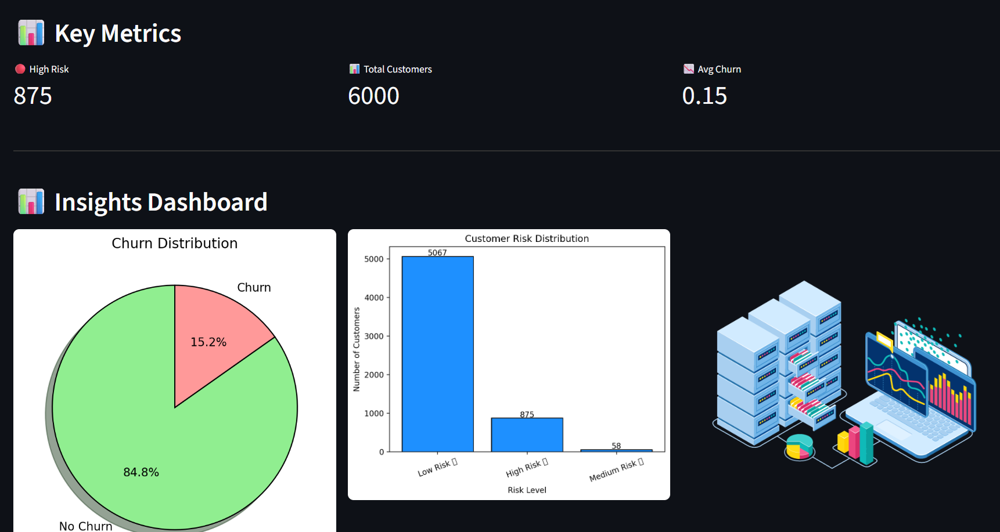
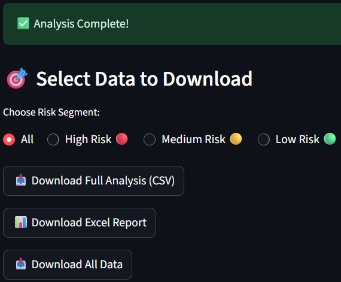

# 🛒 End-to-End Machine Learning Project with Interactive Dashboard & Business Insights

## 📌 Overview

Customer churn is a major challenge in the e-commerce industry, where losing customers directly impacts revenue. This project aims to predict whether a customer is likely to churn using machine learning techniques and provide actionable insights for retention.

---

## 🎯 Objective

* Predict customer churn using historical data
* Identify key factors influencing churn
* Enable businesses to take proactive retention actions

---

## 🧠 Machine Learning Pipeline

1. Data Collection
2. Data Preprocessing (handling missing values, encoding, scaling)
3. Exploratory Data Analysis (EDA)
4. Feature Engineering
5. Model Training (Logistic Regression, Random Forest, etc.)
6. Model Evaluation (Accuracy, Precision, Recall, F1-score)
7. Deployment using Streamlit

---

## 🛠 Tech Stack

* **Programming Language:** Python
* **Libraries:** Pandas, NumPy, Scikit-learn, Matplotlib, Seaborn
* **Deployment:** Streamlit
* **Tools:** Jupyter Notebook

---

## 📂 Project Structure

```
ecommerce-churn-prediction-system/
│
├── app/                # Streamlit web app
├── data/               # Raw dataset
├── models/             # Trained model & features
├── notebooks/          # EDA notebook
├── src/                # Source code (preprocessing, training, prediction)
├── README.md
├── requirements.txt
└── .gitignore
```

---

## 📊 Model Performance

(Add your actual results here)

| Model               | Accuracy |
| ------------------- | -------- |
| Logistic Regression | XX%      |
| Random Forest       | XX%      |

---

## 🌐 Web Application

The project includes an interactive web application where users can:

* Upload customer dataset (CSV)
* Get real-time churn predictions
* Analyze customer behavior

---

## 📸 Screenshots & Features

### 🏠 Home Page – Upload & System Overview


👉 This is the main interface where users can upload a customer dataset (CSV).  
It provides an overview of the system and highlights key features like churn prediction, customer analysis, and actionable insights.

---

### 📊 Risk based Filtering


👉 Enables filtering of customers based on risk segments (High, Medium, Low).  
Users can search specific customers and analyze large datasets interactively.

---

### 🔍 Customer Deep Dive


👉 Allows detailed analysis of individual customers by selecting a Customer ID.  
Displays churn status, risk level, churn probability, and key behavioral signals indicating potential churn.

---

### 📈 Key Metrics & Insights Dashboard


👉 Provides high-level analytics including total customers, churn rate, and risk distribution.  
Includes visual charts like churn distribution and customer segmentation for better business understanding.

---

### 📥 Download & Reporting System


👉 Users can download filtered data or full analysis reports in CSV or EXCEL.  
This feature helps businesses take offline actions based on model predictions.

---

## 💡 Key Insights

* Customers with low engagement are more likely to churn
* High complaint rate increases churn probability
* Discount strategies can help reduce churn

---

## ▶️ How to Run Locally

```bash
pip install -r requirements.txt
cd app
python -m streamlit run app.py
```

---

## 📁 Dataset

* E-commerce customer dataset used for churn prediction
  (Add source if applicable)

---

## 👨‍💻 Author

Devanshu
GitHub: https://github.com/devanshuai
